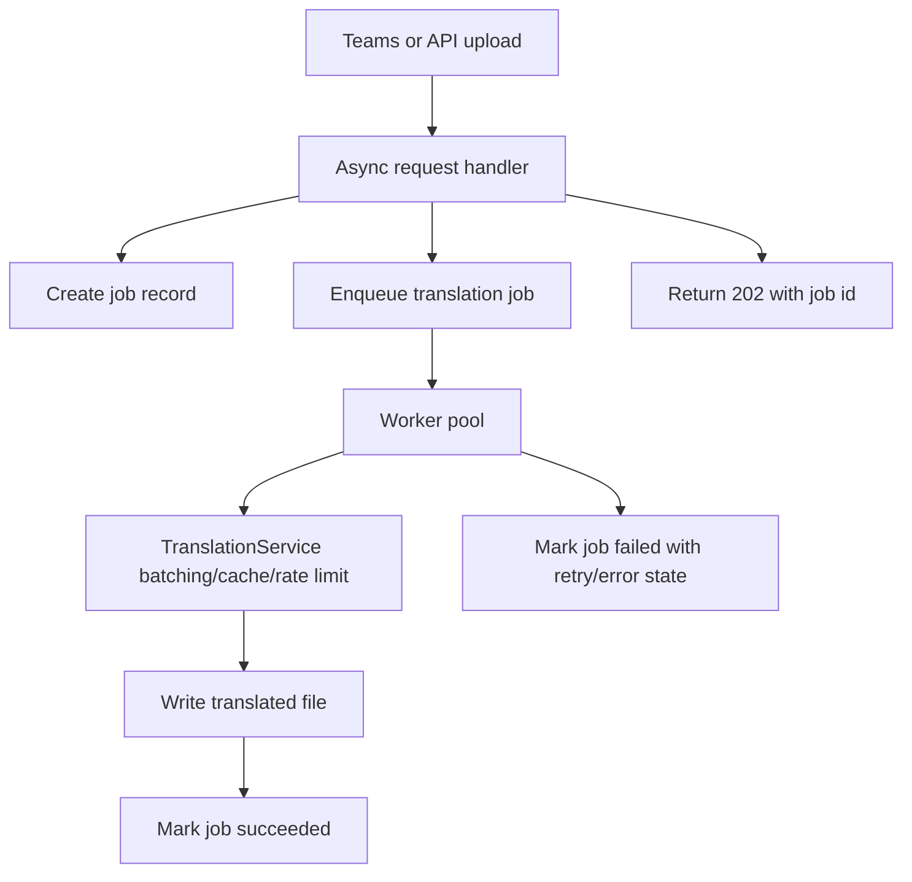
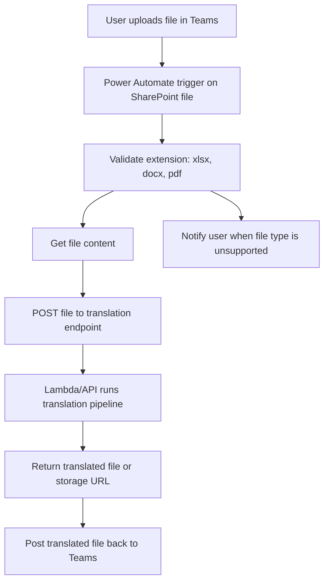

# AI Document Translation Pipeline

Small Python pipeline for extracting French business text from Excel, Word, and PDF files, passing it through the required mock translation service, and writing translated files back locally.

## Setup

```bash
python3 -m venv .venv
source .venv/bin/activate
pip install -r requirements.txt
pip install -e .
```

Run the tests:

```bash
pytest -q
```

Run the pipeline on one file:

```bash
python -m translator.pipeline input/products.xlsx output
```

Run it on a directory:

```bash
python -m translator.pipeline input output
```

## Design

The code uses one dispatcher in `src/translator/pipeline.py` and keeps document handling isolated by format:

- `excel.py`: uses `openpyxl` to add `description_en` next to `description` while preserving other columns.
- `word.py`: uses `python-docx` to replace paragraph and table-cell text while preserving paragraph style and first-run formatting.
- `pdf.py`: uses `pypdf` for extraction and `reportlab` to generate a translated PDF with basic formatting.
- `mock_service.py`: contains the required mock translation function.
- `service.py`: wraps the mock service with a scalable translation facade for batching, deduplication, and caching.
- `async_handler.py`: accepts work asynchronously and returns a job id.
- `jobs.py` and `worker.py`: provide a local file-backed job queue and worker loop for the take-home version.

The document handlers do not call the mock directly. They receive a `TranslationService`, which means large jobs can share one cache across Excel, Word, and PDF files during a directory run. This also creates a single place to add real API behavior later: rate limiting, retries, request batching, telemetry, and circuit breaking.

The scalable path is asynchronous. A request should enqueue a translation job and return `202 Accepted`; workers then process jobs under shared rate limits. The synchronous CLI remains useful for local demos and tests, but it is not the production shape I would choose for large files.

## TDD And Tests

This was implemented with a TDD loop:

1. Add failing tests for Excel, Word, PDF, pipeline dispatch, and the Lambda-style handler.
2. Implement the smallest format-specific modules needed to pass.
3. Keep the tests as regression coverage for the assignment requirements.

The current suite verifies:

- Excel inserts `description_en` next to `description`.
- Existing Excel data remains intact.
- Word text is translated while bullets, tables, and bold text survive.
- PDF output is generated and contains translated text.
- The pipeline dispatches based on file extension.
- The Lambda handler can process a local file event.
- The async handler enqueues a job and the worker processes it later.
- Repeated translation strings are deduplicated and cached through `TranslationService`.
- The integration suite processes Excel, Word, and PDF together through `translate_directory()`.

## Lambda Handler Bonus

`src/translator/lambda_handler.py` is structured as an AWS Lambda entrypoint but runs locally for the test. It accepts an event like:

```json
{
  "storage": "local",
  "input_path": "input/products.xlsx",
  "output_dir": "output"
}
```

Local invocation example:

```bash
python - <<'PY'
import json
from translator.lambda_handler import handler

event = json.load(open("events/sample_local_event.json"))
print(handler(event, None))
PY
```

In production, the local path handling would be replaced by an S3 storage adapter using `boto3`, while keeping `translate_file()` unchanged.

## Async Worker Bonus

For scalability, I would not process large documents synchronously inside the request handler. The async version is represented by:

- `src/translator/async_handler.py`: validates the event, creates a job, and returns immediately with `202 Accepted`.
- `src/translator/jobs.py`: stores local JSON job records for this test. In production this would become SQS plus DynamoDB/Postgres job state.
- `src/translator/worker.py`: claims queued jobs and runs the translation pipeline.

Local async submission:

```bash
python - <<'PY'
import json
from translator.async_handler import handler

event = json.load(open("events/sample_async_event.json"))
print(handler(event, None))
PY
```

Process one queued job:

```bash
python -m translator.worker
```

Production shape:



This lets the system scale by increasing worker count while still enforcing a global translation API budget. If latency is less important than scalability, the worker pool should prioritize durable progress, backpressure, and resumability over immediate completion.

## Power Automate Bonus

Recommended Teams flow:



The endpoint would return either binary file content or a temporary download URL. For a production flow, I would also include correlation IDs, retry handling, and user-facing error messages.

## Real API And 50,000 Rows

If the mock became a real translation API with rate limits and large Excel files, I would change the service layer before changing document parsing:

- Batch translation units through `TranslationService.translate_many()` instead of calling the API per cell.
- Deduplicate repeated strings before translation. This is already implemented for the local service facade.
- Add request throttling, retries with exponential backoff, and timeout handling inside `TranslationService`.
- Cache translations by source text, source language, target language, and model/API version. The in-memory cache already proves the interface; production would use Redis, DynamoDB, or a database table depending on deployment.
- Stream or chunk large workbooks where possible.
- Persist checkpoints so a failed 50,000-row job can resume.
- Track job status, partial failures, and translated-row counts.
- Add structured logs and metrics for latency, API errors, and cost.

For 50,000 rows, the pipeline should treat translation as a job rather than a single request/response call. A production version would enqueue work, process batches with controlled concurrency, update progress after each committed batch, and write partial results safely so the job can resume after a failure.

Rate limiting would live at the worker/service boundary:

- Workers claim jobs only when capacity is available.
- `TranslationService` groups translation units into batches.
- A shared rate limiter controls requests per minute across workers.
- `429` responses honor `Retry-After` and requeue the batch instead of blocking the whole system.
- Job state tracks `queued`, `running`, `succeeded`, `failed`, and eventually `retry_scheduled`.

## AI Configuration

This repo uses Codex as the AI coding assistant, with portable IDE-agent rules for other tools:

- `AGENTS.md` steers Codex and other terminal agents.
- `.cursor/rules/translation-pipeline.mdc` gives Cursor the same repository constraints.
- `.github/copilot-instructions.md` gives GitHub Copilot concise project rules.

These rules tell AI assistants to:

- use only the mock translation service,
- work test-first,
- keep format-specific code isolated,
- preserve document structure,
- avoid cloud deployment,
- document scaling assumptions.

## Known Limitations

- PDF layout is regenerated rather than preserved.
- Word translation currently preserves paragraph style and first-run formatting, but does not preserve mixed formatting inside a sentence perfectly.
- Excel assumes the source column is named `description`.
- The Lambda handler is local-only and intentionally does not use AWS credentials.
